A/B卷測驗
=========

:index:`A/B卷測驗 <問卷; A/B卷>` ，是以兩份不同版本的題目，兩份題目之
間有一個控制變數不同，來比較兩組參與者的回應。在統計上，是一種兩組樣本
的假設檢定。A/B卷測驗常常用在行銷有效性研究上，讓兩組消費者觀看不同的
廣告，來比較兩種廣告的效果；或是讓瀏覽者隨機看到兩種網站設計，再依據
瀏覽者的反應，比較哪種網站設計較優。

LimeSurvey可以用來製作A/B卷測驗：參與者隨機分組，填寫該組問卷。
做法如下：

1. 在問卷最前面，加上隱藏的第零題組別，由亂數隨機分配。
2. 後續的問卷題目，依組別跳題，給參與者不同版本的問卷。

建立隱藏的分組題
################

我們首先建立一份全新的空白問卷，標題填上「促銷文案效果測試問卷」。

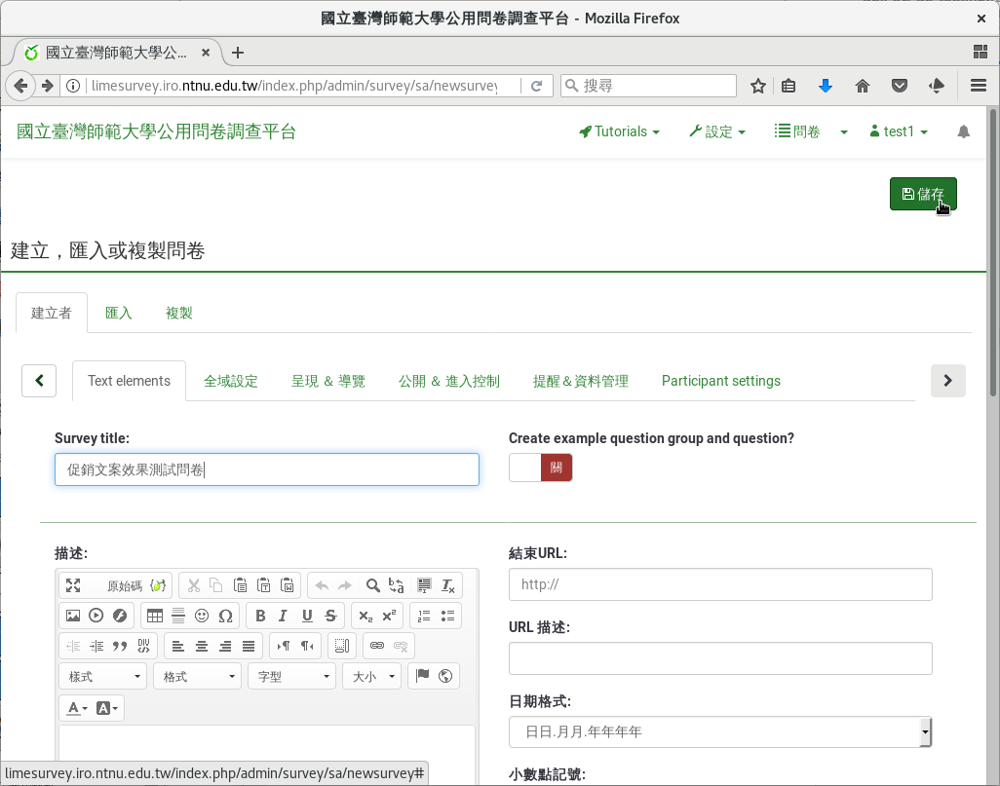

    建立全新的A/B卷測驗問卷

在新問卷上加上一個題組。題組標題填上「促銷文案效果測試問卷」。我們只
需要一個題組。

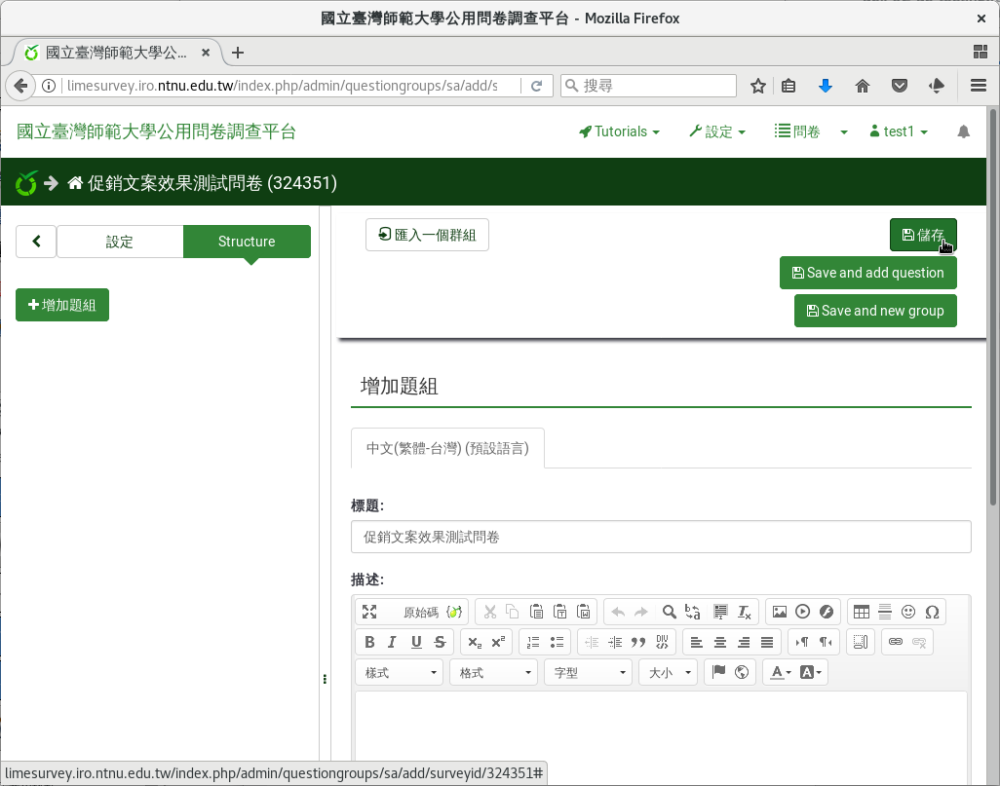

    加上問卷題組

接下來在題組內，加上第零題組別。新增一題問題，在新增問卷問題的編輯
頁面上，問題的主文填上「{rand(1,2)}」，
題型選擇「其他類型問題」裏的「公式」。

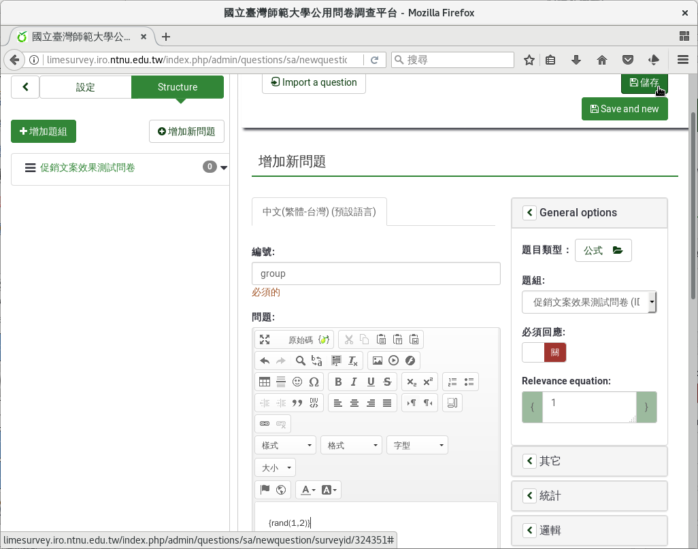

    第零題組別

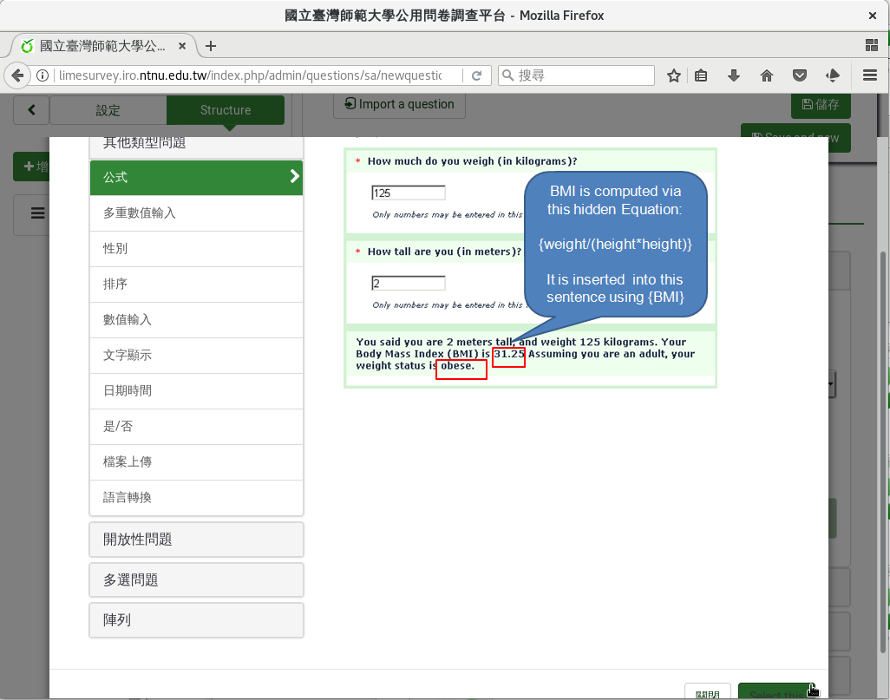

    選擇公式題型

往下拉找到「Display」展開，點按開啟「Always hide this question」。

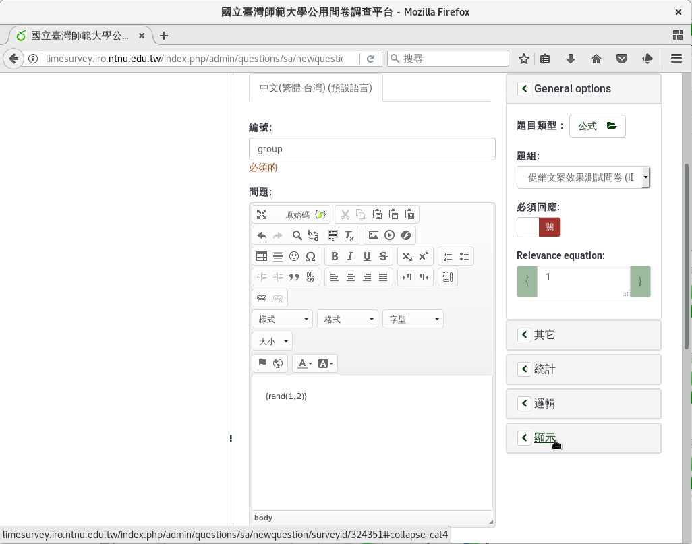

    展開「Display」設定，開啟「Always hide this question」

拉回網頁最上方，按右上角「儲存」。

建立兩組各自的介紹文
####################

接下來我們按照組別，提供不同的介紹文，比較兩者的閱讀效果。

新增第一組的介紹文。第一組是純文字的簡單介紹文。新增一題問題，在新增問
卷問題的編輯頁面上，問題的主文填上：

    玻璃海岸位在宜蘭縣南方澳漁港及內埤海岸(俗稱：情人彎)之間。這片海灣，於民國72年前曾經被稱為「賊仔澳垃圾場」，那時候垃圾車把垃圾從15~20公尺高的懸崖上往下倒，而該垃圾中或多或少也參雜了許多不同顏色的玻璃瓶。經年累月，於環保意識抬頭及保護環境生態的情形之下，當年這些玻璃瓶隨著時間、隨著海浪沖洗，如今已被磨為迷你礫石大小的海玻璃，並與海砂混合在一起，如今也成為大自然的一部分。

題型選擇「其他類型問題」裏的「文字顯示」。然後按「儲存」。

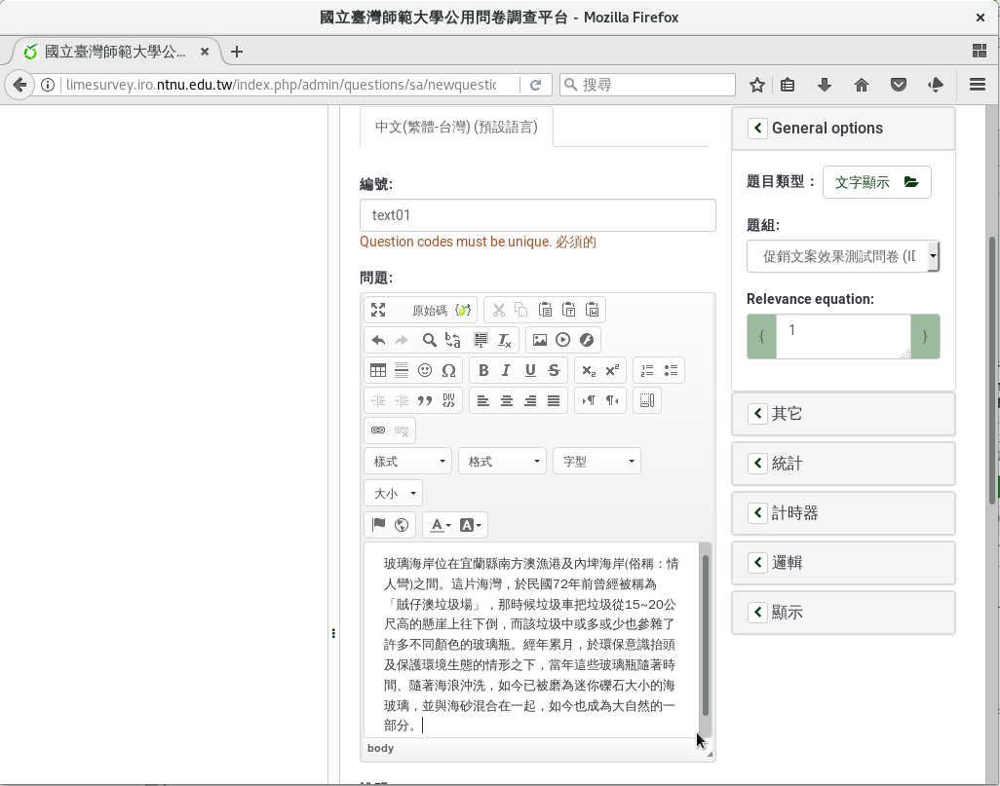

    第一組：格式單調的介紹文

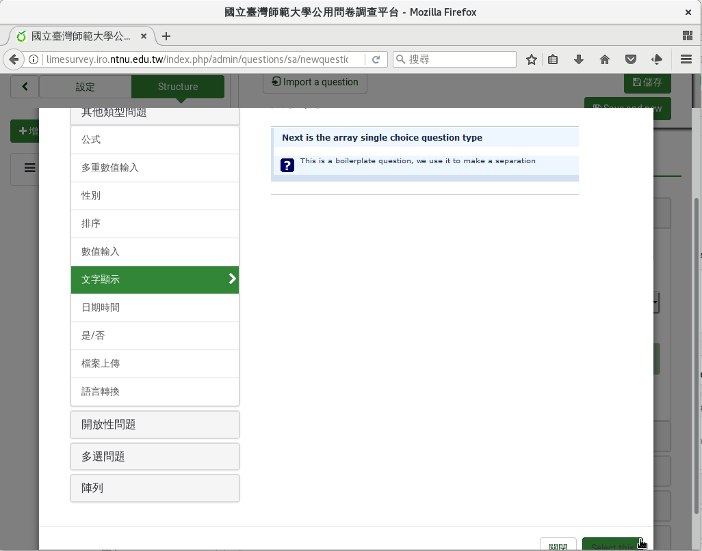

    選擇文字顯示題型

接著按上方「Condition designer」設定問題的條件。在條件設定器頁面上，
問題選剛剛的第零題組別「{rand(1,2)}」答案點右邊「常數」後，
在下方填上「1」，然後按下「增加條件」。

（如果找不到剛剛的第零題，可能是您第零題和介紹文的前後順序反了。
請參閱 :doc:`03-02-06-sort` 的說明，調整問題的位置和順序。）

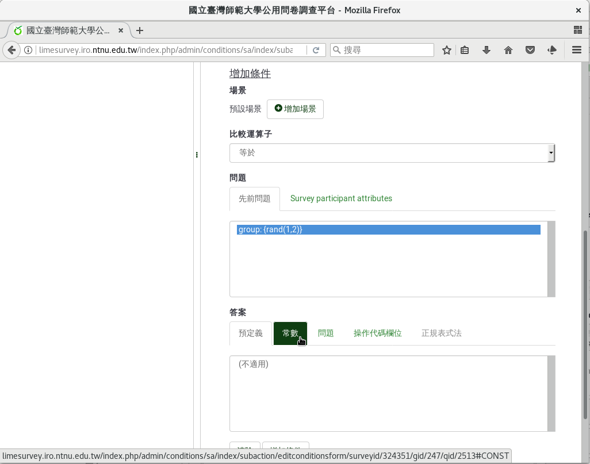

    問題選擇第零題組別，答案切換到右邊的「常數」

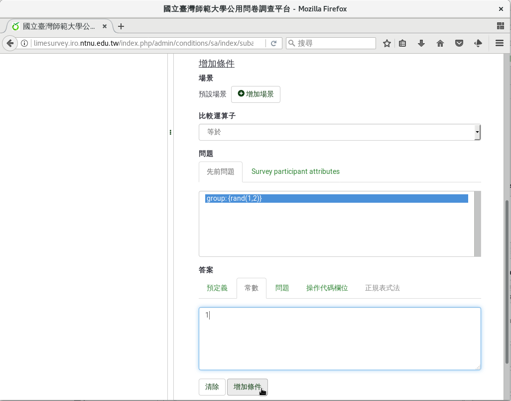

    答案填上「1」

剛剛設的條件就加上去了：

    {rand(1,2)} 等於 1

    設好的第一組介紹文條件

接著新增第二組的介紹文。第二組是把關鍵字都用不同顏色標記起來，格式花俏
的介紹文。新增一題問題，在新增問卷問題的編輯頁面上，
問題的主文填上和第一組一樣的文字：

    玻璃海岸位在宜蘭縣南方澳漁港及內埤海岸(俗稱：情人彎)之間。這片海灣，於民國72年前曾經被稱為「賊仔澳垃圾場」，那時候垃圾車把垃圾從15~20公尺高的懸崖上往下倒，而該垃圾中或多或少也參雜了許多不同顏色的玻璃瓶。經年累月，於環保意識抬頭及保護環境生態的情形之下，當年這些玻璃瓶隨著時間、隨著海浪沖洗，如今已被磨為迷你礫石大小的海玻璃，並與海砂混合在一起，如今也成為大自然的一部分。

然後利用問題主文的格式功能，在關鍵字上標記顏色。你也可以以原始碼編輯，
按下「Toggle source mode」，貼上下列HTML原始碼：

    <strong>玻璃海岸位在宜蘭縣南方澳漁港及內埤海岸(俗稱：情人彎)之間。這片海灣，於民國72年前曾經被稱為「賊仔澳垃圾場」，那時候垃圾車把垃圾從15~20公尺高的懸崖上往下倒，而該垃圾中或多或少也參雜了許多不同顏色的玻璃瓶。經年累月，於環保意識抬頭及保護環境生態的情形之下，當年這些玻璃瓶隨著時間、隨著海浪沖洗，如今已被磨為迷你礫石大小的海玻璃，並與海砂混合在一起，如今也成為大自然的一部分。</strong>

題型一樣選擇「其他類型問題」裏的「文字顯示」。然後按「儲存」。

.. figure:: images/apx-02-02-text-06.png
    :alt: 第二組介紹文的HTML原始碼
    :scale: 48%

    第二組介紹文的HTML原始碼

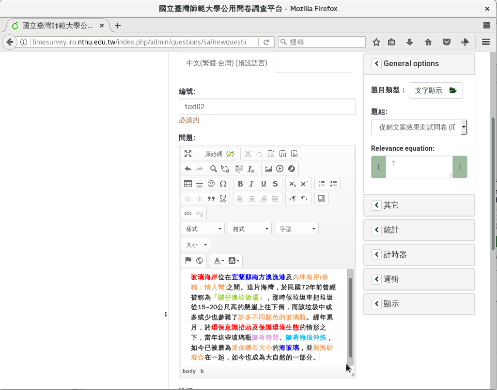

    第二組：顏色花俏的介紹文

接著按上方「Condition designer」設定問題的條件。在條件設定器頁面上，
問題選剛剛的第零題組別「{rand(1,2)}」答案點右邊「常數」後，
在下方填上「2」，然後按下「增加條件」。

（如果找不到剛剛的第零題，可能是您第零題和介紹文的前後順序反了。
請參閱 :doc:`03-02-06-sort` 的說明，調整問題的位置和順序。）

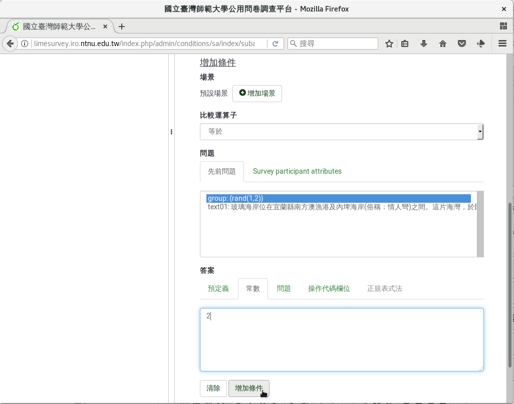

    問題選擇第零題組別，答案切換到右邊的「常數」，填上「2」

剛剛設的條件就加上去了：

    {rand(1,2)} 等於 2

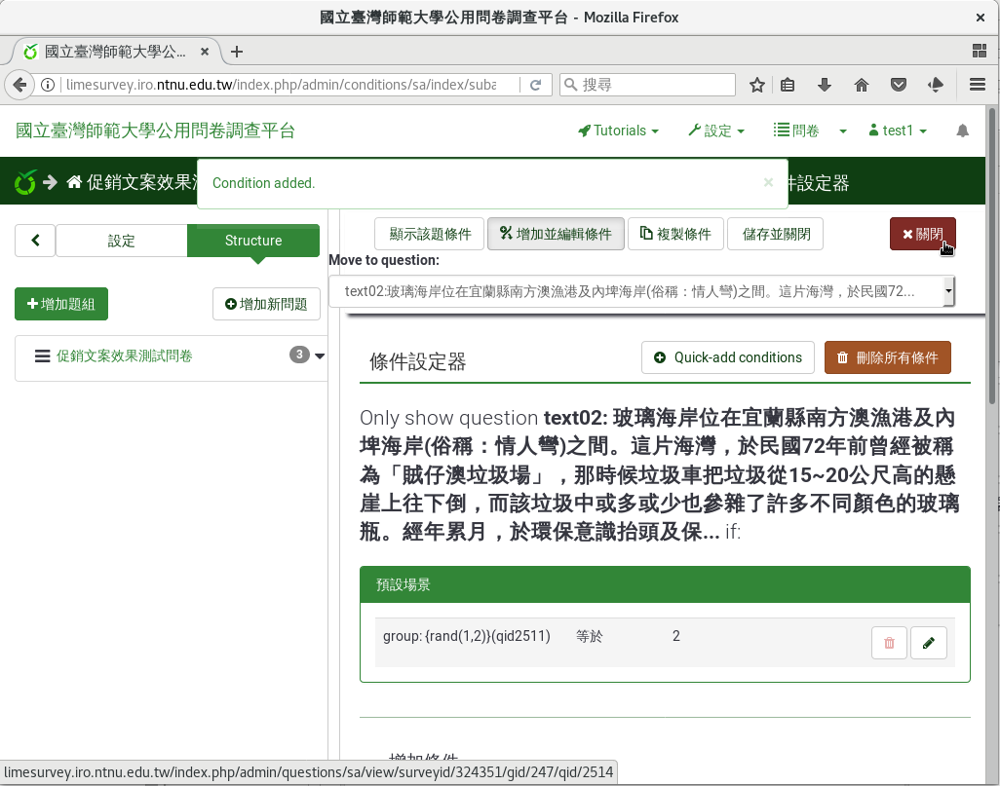

    設好的第二組介紹文條件

建立問卷題目
############

接下來我們建立問卷題目。

第一題詢問介紹文的易讀性。在新增問卷問題的編輯頁面上，問題的主文填上
「上述景點介紹讀起來好不好讀？（1：非常不好讀；2：不好讀；3：普通；4：好讀；5：非常好讀。）」，
題型選擇「單選問題」裏的「5分選擇」，開啟「必填」，然後按右上角的「儲存」。

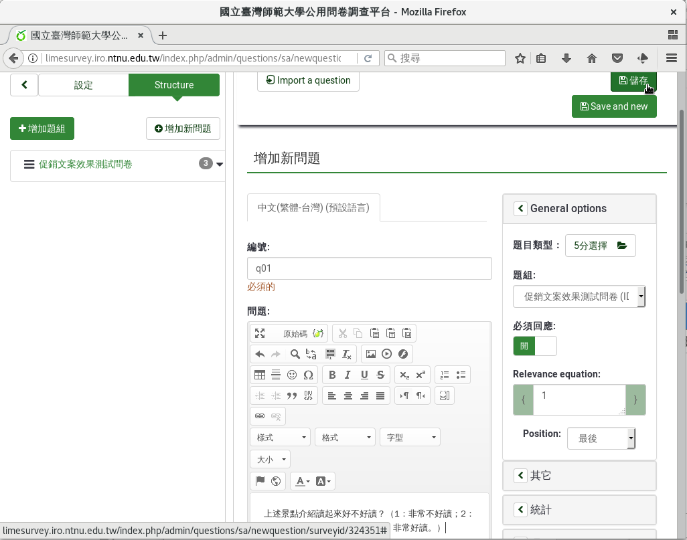

    第一題：介紹文的易讀性

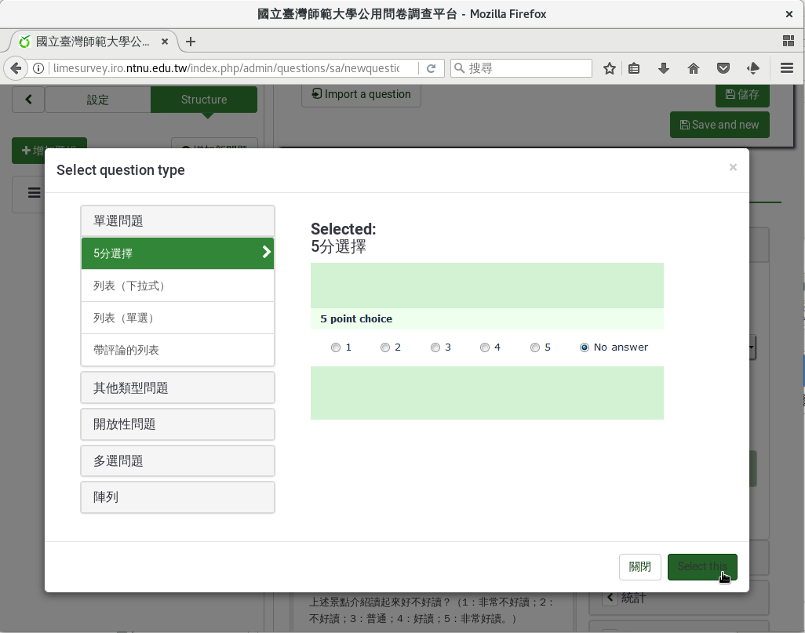

    選擇5分選擇題型

第二題詢問介紹文吸引人的效果。在新增問卷問題的編輯頁面上，問題的主文填上
「讀完上述景點介紹後，你會想去該景點旅遊嗎？」，題型選擇
「其他類型問題」裏的「是／否」，開啟「必填」，然後按右上角的「儲存」。

.. figure:: images/apx-02-03-questions-03.png
    :alt: 第二題：介紹文吸引人的效果
    :scale: 48%

    第二題：介紹文吸引人的效果

第二題詢問參與者的年齡。在新增問卷問題的編輯頁面上，問題的主文填上
「請問您今年幾歲？」，題型選擇「其他類型問題」裏的「數值輸入」，開啟「必填」。

.. figure:: images/apx-02-03-questions-03.png
    :alt: 第三題：參與者的年齡
    :scale: 48%

    第三題：參與者的年齡

往下拉找到「Input」展開。年齡只能填寫整數，最小是1歲。
在Minimum value填上1，Maximum value留白，開啟「Integer only」。

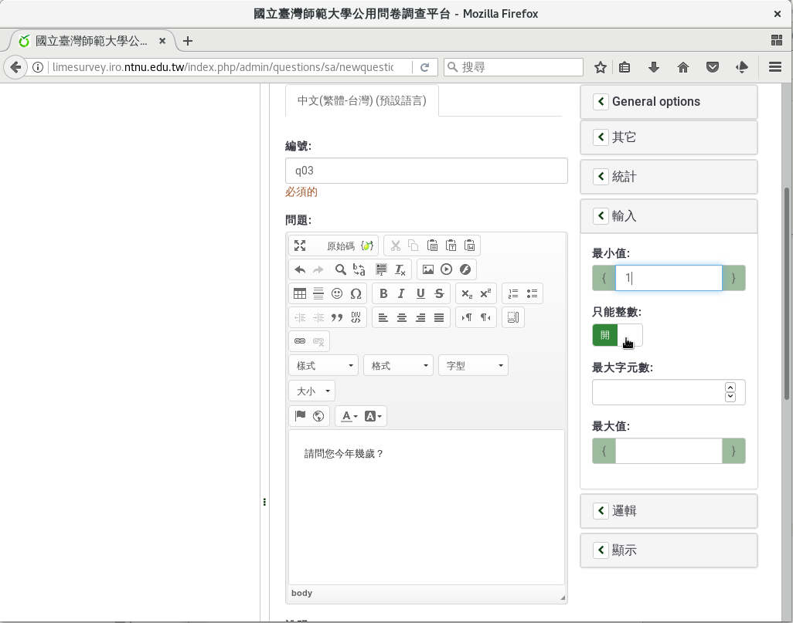

    限制年齡填答範圍

拉回網頁最上方，按右上角「儲存」。

第四題詢問參與者的性別。在新增問卷問題的編輯頁面上，問題的主文填上
「請問您的性別？」，題型選擇「其他類型問題」裏的「性別」，開啟「必填」，
然後按右上角的「儲存」。

    第四題：參與者的性別

這樣一份簡單的A/B卷測驗問卷就完成了。

施測
####

實際執行這份A/B卷測驗看看。從上方按下「預覽問卷」，開始模擬作答。

如圖所示，模擬作答時，問卷系統提供了第一組問卷，格式單調的介紹文。

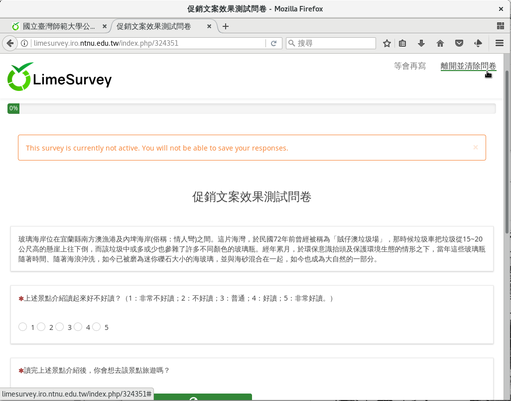

    第一組：格式單調的介紹文

我們重做一次問卷。回去問卷管理，重新按下「預覽問卷」。這一次，
問卷系統提供了第二組問卷，顏色花俏的介紹文。

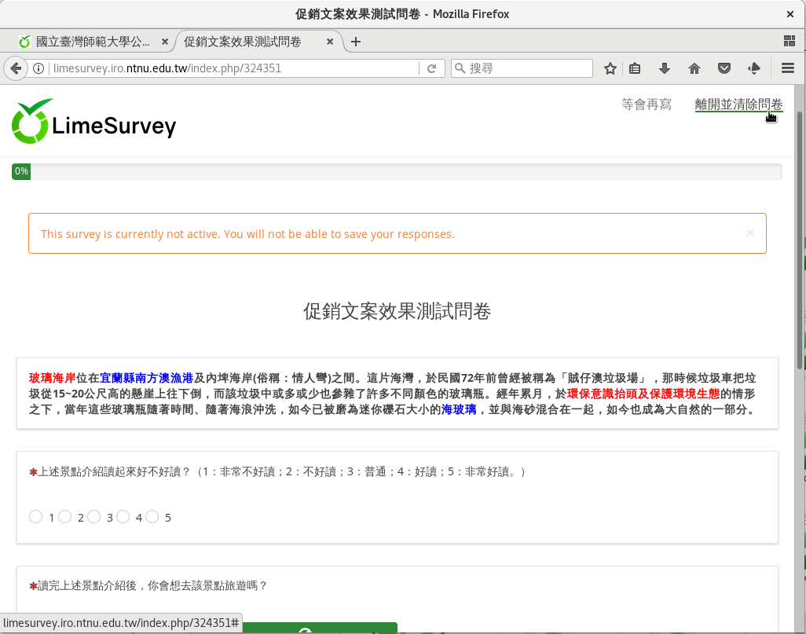

    第二組：顏色花俏的介紹文

分組是隨機分配的，執行的的結果可能有所不同。如果看不到另外一組問卷，
可以多試幾次，回去問卷管理重新按下「預覽問卷」，再重新作答。
